# Art Vault -- Online Art Gallery 
🌐 Responsive Frontend Showcase  
DecodeLabs Full Stack Development Internship — Project 1: Frontend Design & Interaction

**Live Demo:** [View Live](https://rishika5v2.github.io/Task-1-Janga-Sai-Rishika/)

---

## 📖 Overview
**Art Vault** is a fully responsive online art gallery built as Project 1 for the DecodeLabs Industrial Training Kit. It's a pure frontend application showcasing contemporary and modern art pieces across multiple categories, featuring elegant UI design with a rich color palette and smooth interactive elements.

The gallery goes beyond static display — it includes featured artwork highlights, category-based browsing, individual artist profiles, and a responsive experience optimized for all device sizes.

---

## 🚀 Live Features

✨ **Featured Showcase** — Highlighted artworks with high-impact imagery and descriptive overlays  
🎨 **Art Categories** — Browse by genre/style with category-specific landing sections  
👥 **Artist Profiles** — Discover work by Sofia Mercer, Priya Nair, Lena Voss, and Arjun Mehra  
🖼️ **Individual Art Pages** — Detailed views with title, artist, medium, year, and full descriptions  
🎯 **Smooth Scrolling** — Fluid navigation between sections with IntersectionObserver scroll effects  
📱 **Fully Responsive Design** — Mobile-first layout with optimized breakpoints for tablet and desktop  
⚡ **Image Optimization** — High-performance `.avif` format images stored in `/images/` folder  
🎭 **Rich Color Palette** — Deep burgundy, cream, and gold accent scheme for gallery elegance  
🔍 **Interactive Elements** — Hover effects, transitions, and smooth page interactions  

---

## 🛠 Tech Stack

- **HTML5** — Semantic markup with proper document structure  
- **CSS3** — Flexbox + CSS Grid for layouts, `clamp()` for fluid typography, smooth transitions and animations  
- **JavaScript (Vanilla)** — DOM manipulation, scroll-spy navigation, smooth scrolling, IntersectionObserver for reveal animations  
- **Image Format** — AVIF images for optimized performance  
- **No Dependencies** — Pure vanilla implementation; no frameworks or libraries  

---

## 📁 Project Structure
art-vault/

├── index.html          
├── style.css           
├── script.js             
├── images/             
└── README.md

---

## 🎨 Design System

### Color Palette
- Deep Burgundy: #5c1f2e (Headers, accents)
- Cream: #f5f1e8 (Background, text contrast)
- Gold: #d4af37 (Highlights, borders)
- Off-White: #faf8f5 (Secondary background)

---

## 📱 Responsive Design

| Breakpoint | Behavior |
|-----------|----------|
| **Mobile** (<768px) | Single-column layout, hamburger nav, stacked cards |
| **Tablet** (768–1023px) | Two-column grids, visible sidebar |
| **Desktop** (≥1024px) | Multi-column layouts, full navigation |

---

## ▶️ Running Locally

1. Clone or download the repository
2. Open `index.html` directly in your browser
3. No server or build setup required

Or use a local server:
```bash
python -m http.server 8000
```

---

## 📸 Screenshots

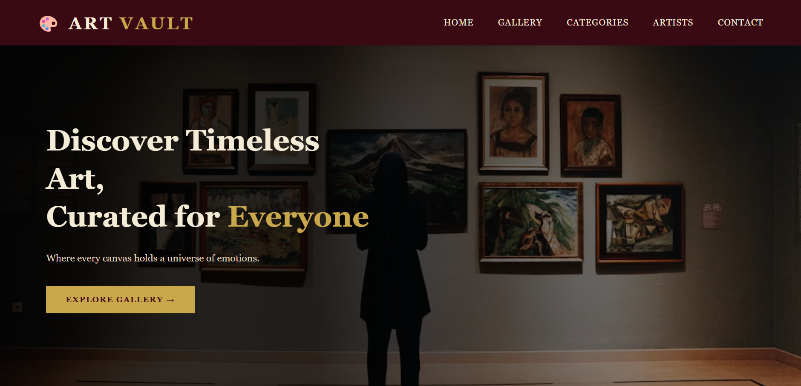
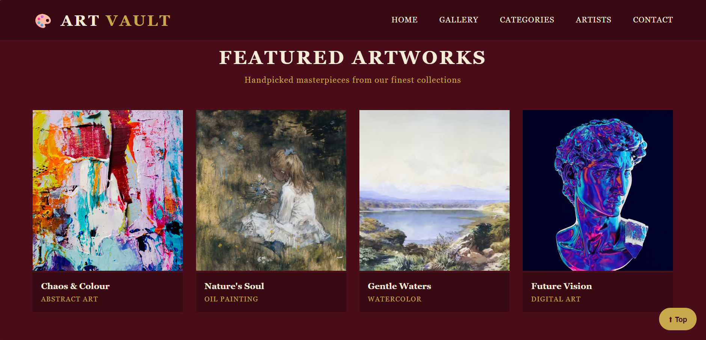
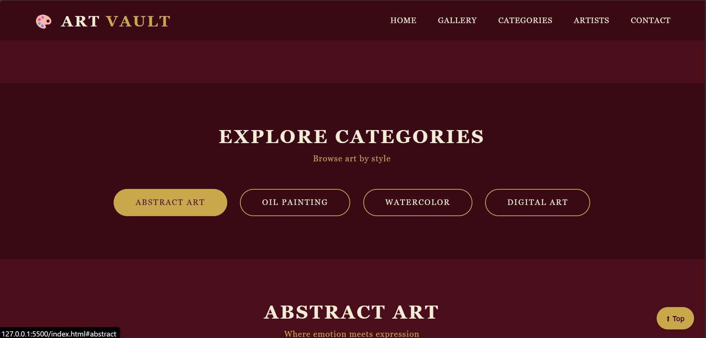
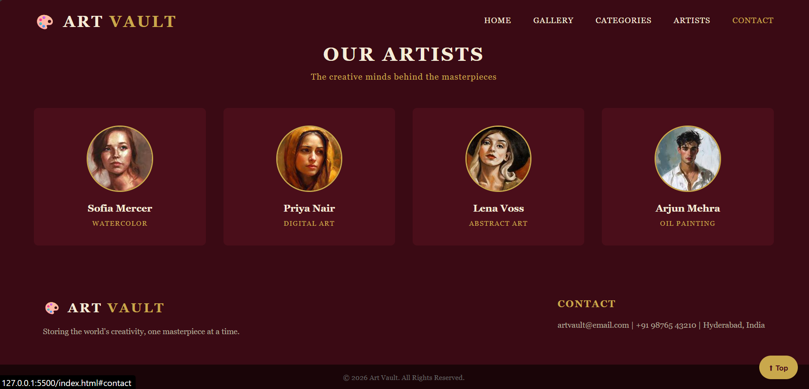
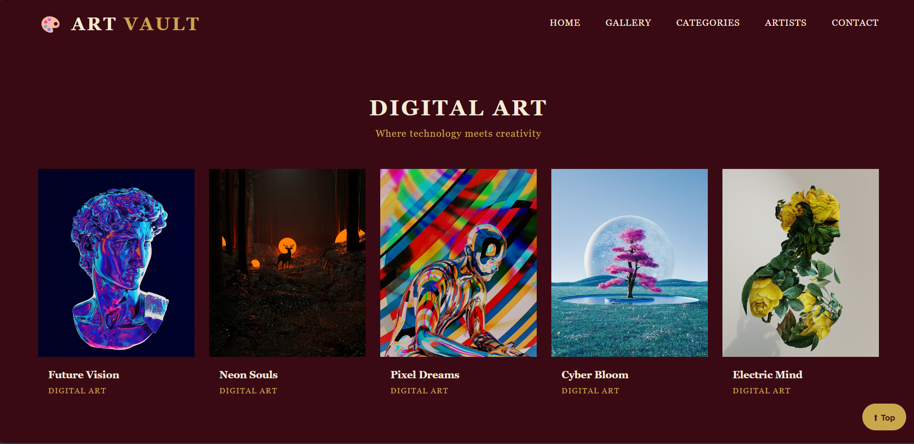
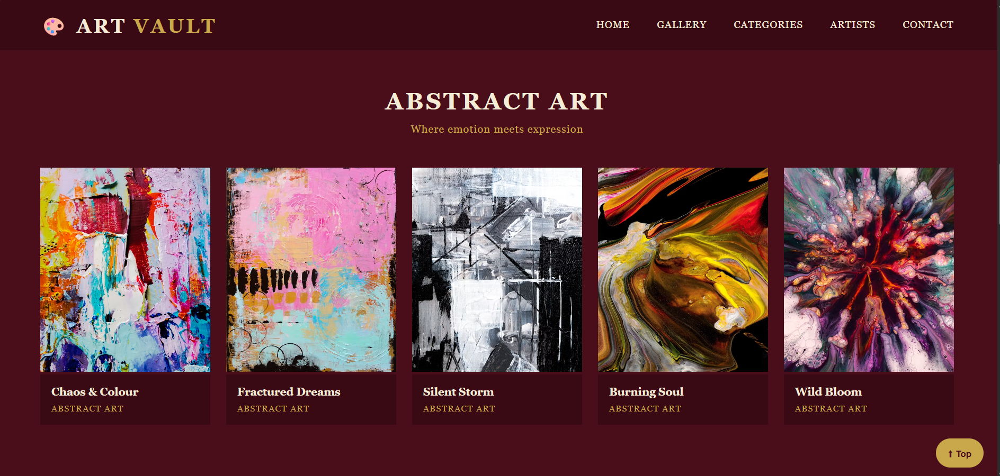
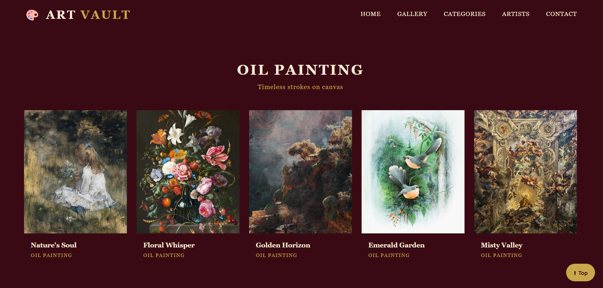
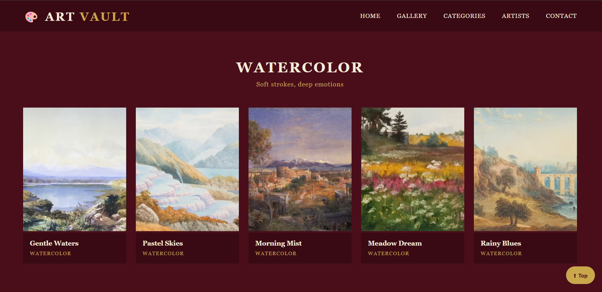
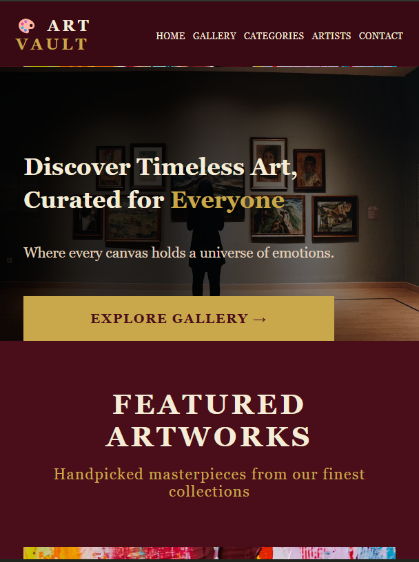
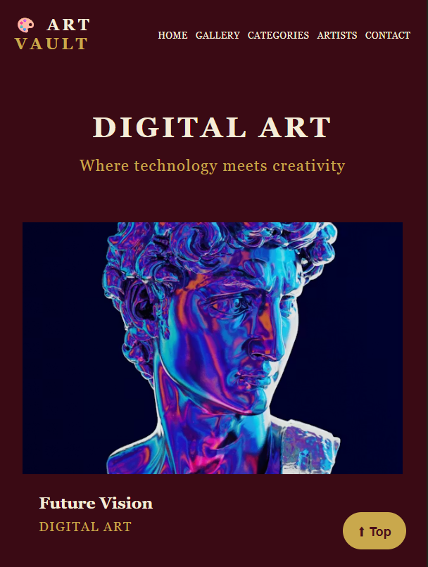
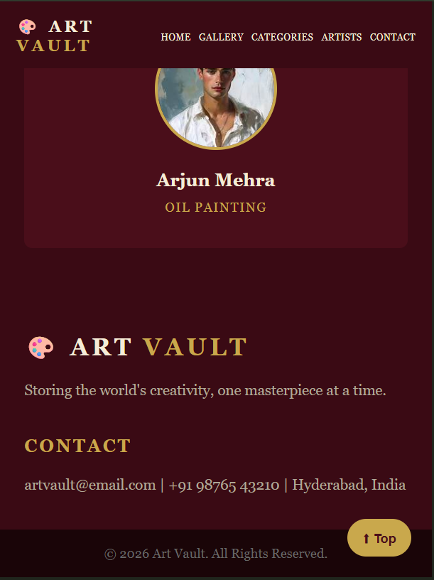

---

## 🔮 Future Enhancements

This frontend is designed to be **API-ready** for future integration with Node.js/Express backend and database.

---

## 📝 Status

✅ Project 1 Complete  
**Next:** Backend integration in Project 2
